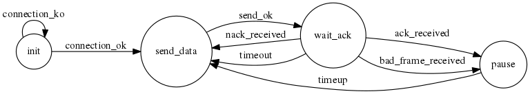
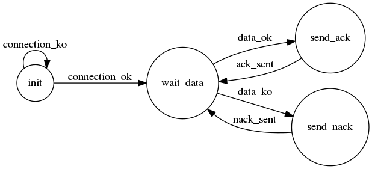

========
Examples
========

This folder contains several code examples of the use of `python4yahdlc <https://github.com/SkypLabs/python4yahdlc>`_.

The code examples work in pairs: `send_data_frame.py <https://github.com/SkypLabs/python4yahdlc/blob/master/examples/send_data_frame.py>`_ works with `receive_data_frame.py <https://github.com/SkypLabs/python4yahdlc/blob/master/examples/receive_data_frame.py>`_ and `fsm_endpoint_1.py <https://github.com/SkypLabs/python4yahdlc/blob/master/examples/fsm_endpoint_1.py>`_ works with `fsm_endpoint_2.py <https://github.com/SkypLabs/python4yahdlc/blob/master/examples/fsm_endpoint_2.py>`_.

Setting up a virtual serial bus
===============================

To make the two code examples of each pair work together, you need a serial bus of communication. The easiest way to set up a serial bus is to use a virtual one. `socat <http://nc110.sourceforge.net/>`_ is a great tool for carrying out this task:

::

    socat -d -d socat -d -d pty,raw,echo=0 pty,raw,echo=0

This command will create two virtual devices such as ``/dev/pts/5`` and ``/dev/pts/6``. Everything you write in ``/dev/pts/5`` will be echoed in ``/dev/pts/6`` and vice versa.

``send_data_frame.py`` and ``receive_data_frame.py``
====================================================

These two code examples need ``pyserial`` as dependency:

::

    pip3 install pyserial

``fsm_endpoint_1.py`` and ``fsm_endpoint_2.py``
===============================================

These two code examples need ``pyserial`` and ``fysom`` as dependencies:

::

    pip3 install pyserial fysom

``fysom`` is used to define the Finite-State Machines (FSM) of the two endpoints.

The sending FSM endpoint:

|FSM Endpoint 1|

The receiving FSM endpoint:

|FSM Endpoint 2|

